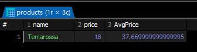

```sql
SELECT u.id, u.username, u.phone, o.id, od.product_id
  FROM users u 
    LEFT JOIN orders o 
    ON u.id = o.user_id
    INNER JOIN orderdetails od ON o.id = od.order_id
    ORDER BY u.id;
```
- FROM 내에서는 join을 중첩해서 사용가능 . 이상의 경우에서는 첫번째 join의 on 절 뒤에, 두번째 join을 작성했다고 볼 수 있습니다.
필요한 정보가 셋 이상의 테이블에 나뉘어 있어도, 키 값을 기반으로 연결할 수 있다면 한번에 조회할 수 있습니다.(근데 서브쿼리 배우면 대부분 서브쿼리 쓰겠다고 하다가 망하는 경우가 있음). 예제 쿼리는 LEFT(outer) join을 통해 주문 정보가 없는 회원의 주문 정보를 포함 했고, inner join을 통해 orders / orderdetails의 교집합 정보만을 출력했습니다.
    - 근데 확인해보니까 어차피 orders에 주문을 했어야 주문 세부 사항이 나오니까 left join만 썼어도 결과 차이는 없더ㅏ.

예제: users와 orders를 하나로 결합하는데, 회원정보가 없는 주문 정보도 출력할 수 있도록 작성

```sql
# 주문 내역이 없는 회원만 출력되었습니다.
SELECT * 
    FROM users u RIGHT JOIN orders o ON u.id = o.user_id
    ORDER BY u.id
# 주문 내역이 없는 회원도 출력하려면(RIGHT JOIN을 활용하여)
SELECT * 
    FROM orders o RIGHT JOIN users u ON o.user_id = u.id
    ORDER BY u.id
```

이상의 경우에서는 차 집합 개념을 들 수 있는데, 그렇다면 LEFT JOIN과 동일한 기능을 하는 것처럼 보입니다. 하지만 inner JOIN과 결과값이 같다(즉, 주문 내역이 없는 회원의 정보는 출력되지 않았음을 알 수 있다.)

그래서 LEFT JOIN과 명확히 동일한 결과값을 만들기 위해서는 테이블 순서를 바꿀 필요가 있습니다.
이상과 같은 이유로 많은 기업에선 RIGHT JOIN 대신에 LEFT JOIN만 사용하도록 권장하는 편입니다. 먼저나온 테이블이 기준이 되도록 해서
LEFT JOIN만 쓰든지, 아니면 교집합만 사용하기 위해 inner JOIN을 쓴다고 보셔도 무방합니다.

예제 : user와 orders의 _모든 가능한 행 조합_ 을 만들어 내는 SQL쿼리를 작성하시오
```sql
SELECT *
    FROM users u CROSS JOIN orders o
    ORDER BY u.id
    ;
```

- CROSS JOIN은 두 집합을 _조합_ 해 만들 수 있는 _카테시안 곱(cartesian product)_ 을
출력합니다. 순서는 u.id를 기준으로 작성해뒀습니다.
 모든 조합이 나오기 때문에 LEFT / RIGHT / INNER JOIN 처럼 u.id = o.user_id 같은 조건없이
 두테이블의 모든 행을 합쳐서 만들 수 있는 모든 경우의 수를 출력하는 겁니다. 그렇다면 10개의 row를 지니는 테이블과 20개의 row를 지니는 테이블을 CROSS JOIN하면 10*20 으로 200 개의 row를 지니는 행이 나오며, 이외의 경우의 수는 존재하지 않는다. _모든_이 매우 중요함. _조건_ 없슴니다.

이상의 이유로 실제 운영환경에서는 CROSS JOIN을 제한하는 편입니다. 컴퓨터의 리소스를 너무 잡아먹는 데다가 실질적으로는 쓸모가 없음

CROSS JOIN과 유사해보이기는 하지만 조금 다른 FULL OUTER JOIN이라는 것도 있음

FULL OUTER JOIN = LEFT JOIN + RIGHT JOIN - INNER JOIN

# JOIN 정리하기
- JOIN은 복수의 테이블을 하나로 결합할 때 사용. 여러곳에 기록된(정규화)된 데이터를 마치 하나의 테이블 처럼 합칠때 사용

형식 : 
```sql
FROM
    테이블1 a (LEFT/INNER) JOIN 테이블2 b
    ON a.PK = b.FK;
```
JOIN은 FROM 절에서 수행됩니다. 그렇다면 _가장먼저_ 실행된다고 볼 수 있습니다. JOIN이후 나머지 WHERE, GROUP BY, HAVING, SELECT, ORDER BY가 실행되기 때문에 FROM 절에서 지정한 표의 별칭을 이후 제어문에서 전부 사용이 가능합.

또한 조건에서 볼 수 있듯이 _공통된 컬럼 값인 키 값_ 이 존재해야지만 JOIN으로 결합 할 수 있습니다. 키 값은 여러 개가 있을 수 있어, 어떤 값을 기준으로 할지 ON에서 명시합니다. (저희 예제에서는 PK / FK가 하나씩 입니다.)

JOIN 중첩하기
```sql
FROM 테이블1 a
    (LEFT / INNER) JOIN
    테이블2 b
    ON a.PK = b.FK
    (LEFT / INNER) JOIN
    테이블3 c
    ON 조건어쩌고 = c.FK;
```
- INNER JOIN : 각 테이블의 키 값이 일치하는 행만(교집합만) 출력함. 가장 기본적인
default JOIN이기 때문에 INNER 생략이 가능합니다. 그런데 가독성 문제로 명시적으로
INNER를 작성할 것을 권장합니다.

- LEFT (OUTER) JOIN : 왼쪽 테이블의 모든 데이터를 결과에 포함시켜서 출력
- RIGHT (OUTER) JOIN : 오른쪽 테이블의 모든 데이터를 결과에 포함시켜서 출력
- FULL OUTER JOIN: 좌우측 테이블의 모든 데이터를 결과에 포함시켜서 출력(CROSS와의ㅏ 차이점 유의)

- CROSS JOIN
```sql
FROM 
    테이블1 a CROSS JOIN 테이블2 b
```
근데 사실 CROSS 쓸거면 조건이 필요없으니까 테이블 별칭이 없어도 되지 않냐 싶을 수도 
있는데. SELECT에서 필요한 컬럼만 뽑아낼때 쓰기 때문에 조건이 없더라고 별칭은 정해주는 편입니다.

FULL OUTER JOIN은 조건에 부합할 때만 결과값을 만들어내지만 CROSS JOIN은 모든 경우의 수를 전체 출력합니다. 다릅니다.


# sub Query
- SQL의 쿼리 결과를 테이블 처럼 사용하는 쿼리 내부의 쿼리
- 이상의 학습 내용과는 다르게, 기존에 데이터를 결합할때 이미  존재한 ㅡㄴ 테이블에 접근하여 결합을 시도했습니다. 하지만 이제부텅 기존 태이블을 편집하여 만든 결과값을 기준으로 다시 쿼리를 실행하는 형태로 수업이 이루어지게 됩니다.

즉 개발자가 작성한 쿼리를 실행하여 나온 결과값을 테이블 처럼 사용하거나 조건 또는 값으로 사용할 수 있을까 관련된 내영 

서브 쿼리는 select 문 내의 여러곳에서 사용이 가능하데, 사용하는 

예제 : products에서 제품 명과 정상 가격을 모두 불러오고 평균 정상 가격을 새로운 컬럼으로 각 행 마다 출력하시오
```sql
SELECT name, price, (SELECT AVG(price) FROM products) AS avgProduct FROM products;
```

`select AVG(price) FROM products;` 의 결과값은 : 전체 price들의 총합을 row 개수만큼 나눈 평균값에 해당할겁니다.

그리고 이상의 select avg(price) from products 쿼리를 실행했을때는 row=1 / column=1인 테이블이 하나 나옵니다.

그리고 이 단일한 결과값이 나온 태이블을
```sql
SELECT name, price, (SELECT ROUND(AVG(price), 2) FROM products) AS avgProduct FROM products;
```

이렇게 적용시키면 전체 테이블은 name, price, avgProuct로 이루어진 세개의 컬럼을 지닌 테이블이 나오게 될텐데, 서브 쿼리의 결과가 하나의 값만 있기 때문에 모든 row에 SELECT AVG(price) FROM products의 결과값이 붙여서 출력됩니다.

이처럼 _SELECT 절에는 '단일 값을 반환'하는 서브 쿼리가 올 수 있는데_ 이를 `스칼라(Scalar) 서브 쿼리`라고 합니다.

결과 화면의

```sql
SELECT name, price, 100.00 AS fakePrice
FROM products;
# 오류 나는 예시
SELECT name, price, AVG(price) AS AvgPrice FROM products;
```


이상의 경우처럼 첫 행만 출력 되거나 DB에 따라서는 GROUP BY가 없는 상태라서 오류가 발생합니다. 애초에 집계함수니깐요

```sql
SELECT name
    , price
    , (select ROUND(AVG(price) FROM products), 2) as avgProduct
    , (select ROUND(AVG(discount_price) FROM products), 2) as avgDiscountPrice
    FROM products;
```
에제 : users에서 city 별 회원 수을 카운트 하고, 회원 수가 3명이상인 도시명과 회원 수를 출력할 것(단, 회원수를 기준으로 내림 차순 정렬)

```sql
SELECT *
 	FROM
 	(
	 SELECT city, COUNT(DISTINCT id) AS city_user FROM users GROUP BY city
	 ) temp
	WHERE city_user > 2
	ORDER BY city_user DESC;
```

그리고 서브쿼리를 적용했을 때는 이상과 같이 작성할 수 있습니다

주요 사함으로는
1. FROM 절 내에 서브 쿼리가 들어갔다는 점입니다. -> 편집이 이루어진 새로운 테이블을 기준으로 새로운 쿼리문을 작성했다는 부분.

2. 이상과 같이 FROM 절 내에 서브 쿼리가 들어가는 것을 인라인 뷰(Inline view)라고 표현합니다,

## Inline View
특징 : 
1. 인라인 뷰 내에는 또 다른 서브 쿼리가 개수 제한 없이 중첩적으로 들어갈 수 있음.
2. 인라인 뷰의 서브 쿼리는 괄호 안에 작성한 쿼리의 결과값 자체를 테이블에 존재하는 데이터로 간주하고, 이에 대한 로직을 수행합니다.
그래서 위의 예시를 보면 서브 쿼리의 연산 결과로 city / userCnt 라는 두개의 컬럼이 생긴다는 것을 알 수 있습니다. 즉, city / userCnt라는 컬럼을 가지고 있는 테이블을 기준으로 SELECT *을 수행했디 대문에 최종 결과값에서도 city ./ 

kyle의 staff_id = 3 이고 Scott의 staff_id = 5입니다. 이를 가지고 orders 테이블의 staff_id와 연결하여 원하는 주문 정보만 조회한 경우가 되겠습니다.
where staff_id IN() 으로 작성 했을 때 () 내부에 여러개의 데이터를 집어 넣을 수 있다는 점은 우리가 이미 알고 있습니다. 그렇다면 서브 쿼리의 내부 결과물은 3, 5가 출력 되어서 나왔을 것이고,

```sql
select * from orders
where staff_id in(
                    3, 5
                 )
```
와 같은 연산 결과가 나옴,

예제 : products에서 할인 가격이 가장 비싼 제품 출력

```sql


```